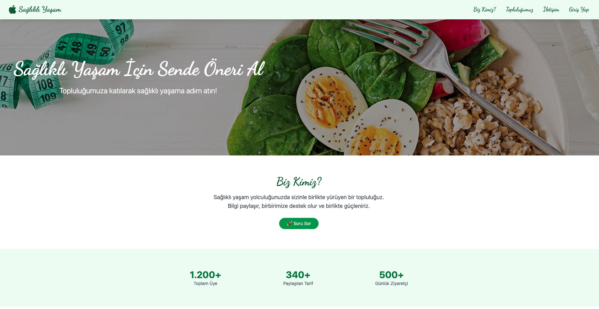
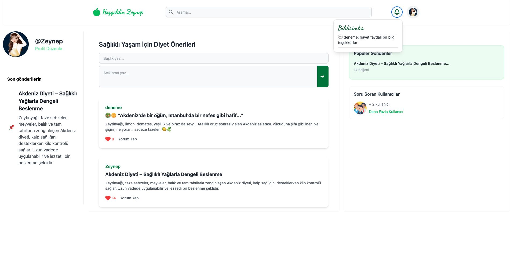
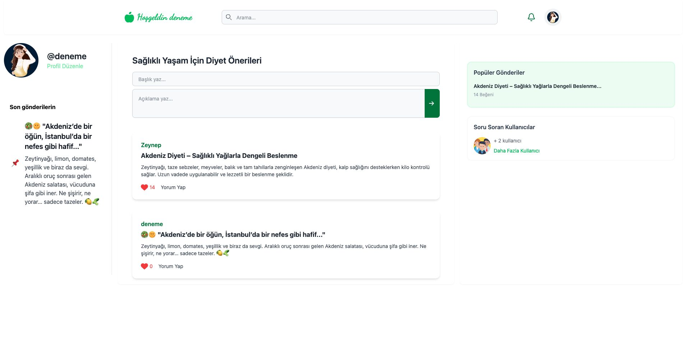
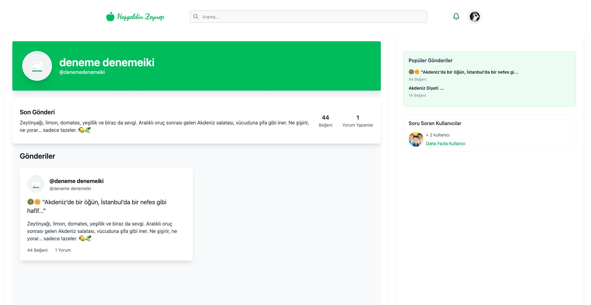
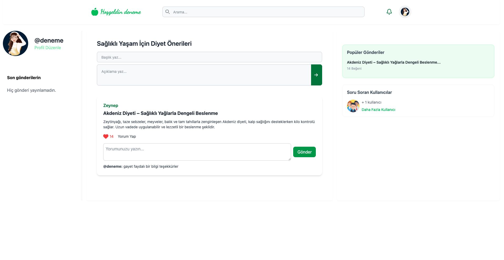
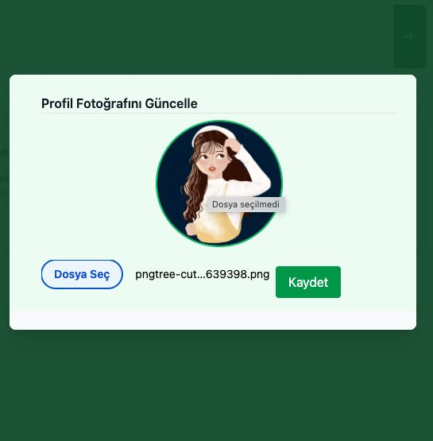
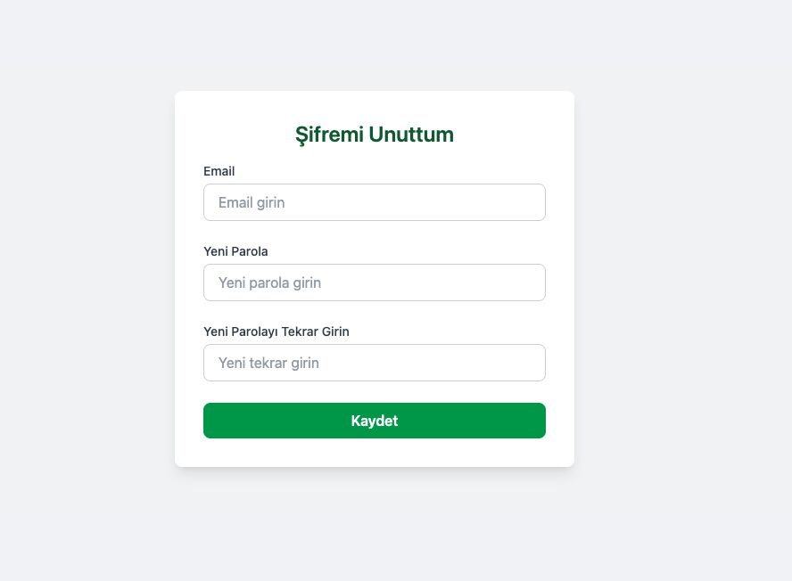
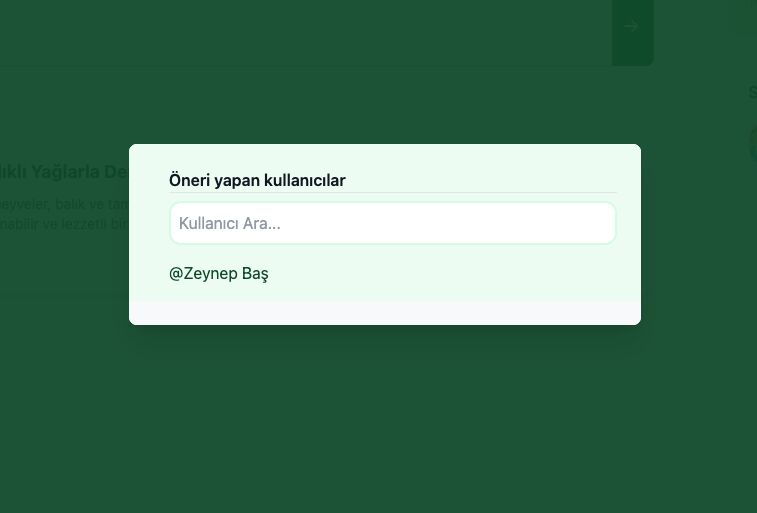
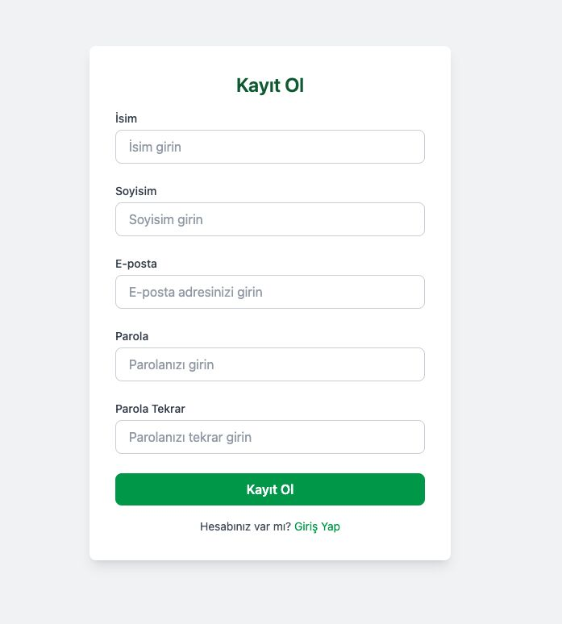
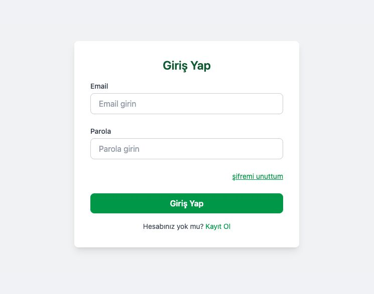

STACK Diyet, kullanıcıların sağlıklı yaşam odaklı içerikler paylaşabildiği, gönderileri beğenip yorumlayabildiği ve diğer kullanıcılarla etkileşim kurabildiği sosyal bir web uygulamasıdır. Kullanıcı profili yönetimi, gönderi paylaşımı, arama, bildirimler ve kullanıcı etkileşimleri gibi özellikler sunan proje, React, Node.js, Express.js, MongoDB ve Zustand kullanılarak geliştirilmiştir.

---

## 🔍 Proje Özellikleri

### ✅ Kullanıcı Girişi
- Kayıt olabilir ve giriş yapabilir.  
- Şifre sıfırlama işlemi yapılabilir.

### ✅ Gönderi Paylaşımı & Etkileşim
- Gönderi paylaşabilir, beğenebilir ve yorum yapabilir.  
- En çok beğeni alan gönderileri görebilir.  
- Paylaşılan gönderilerde arama yapılabilir.

### ✅ Profil ve Kullanıcı Yönetimi
- Diğer kullanıcıların profillerine ulaşabilir.  
- Son gönderilerini görebilir.  
- Görsel (profil/gönderi) güncellemesi yapabilir.  
- Kendi gönderilerini düzenleyebilir veya silebilir.  
- Profilime git sekmesinden kendi gönderilerini yönetebilir.  

### ✅ Arama & Bildirimler
- Kullanıcı araması yapabilir ve profillere gidebilir.  
- Yorum yapıldığında bildirim alabilir.  
- Soru soran kullanıcıları ve tüm kullanıcıları listeleyebilir.

---

## 🛠️ Kullanılan Teknolojiler

**Frontend:** React.js, Tailwind CSS, FontAwesome (ikonlar için)  
**Backend:** Node.js  
**State Management:** Zustand  
**Email Gönderimi:** React EmailJS paketi  
**Veri Yönetimi:** MongoDB & Express.js  

---

## 💡 Proje Hedefleri
- Kullanıcı deneyimini geliştirmek  
- Dinamik kullanıcı profilleri oluşturmak  
- Etkileşimli gönderi sistemi kurmak  
- Gerçek zamanlı bildirim ve etkileşimleri uygulamak  
- Teknik altyapıyı güçlendirmek ve full-stack yetkinliği artırmak

---

## Arayüzler

  

  

  

  

  

  

  

  

  

  

