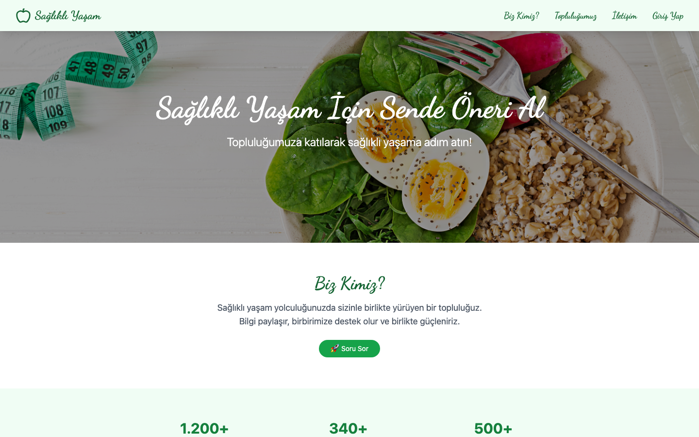
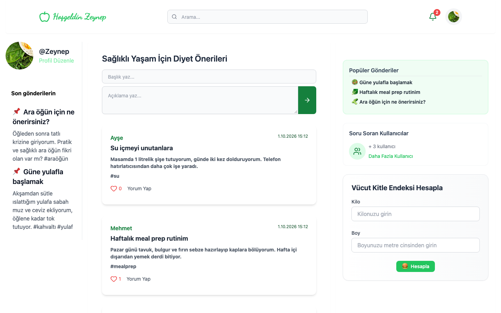
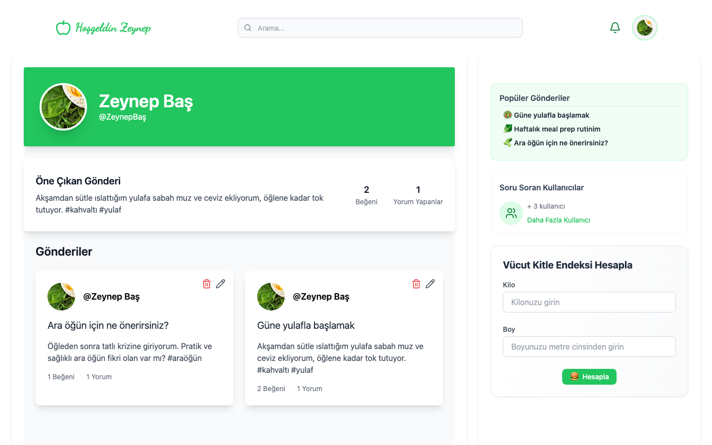
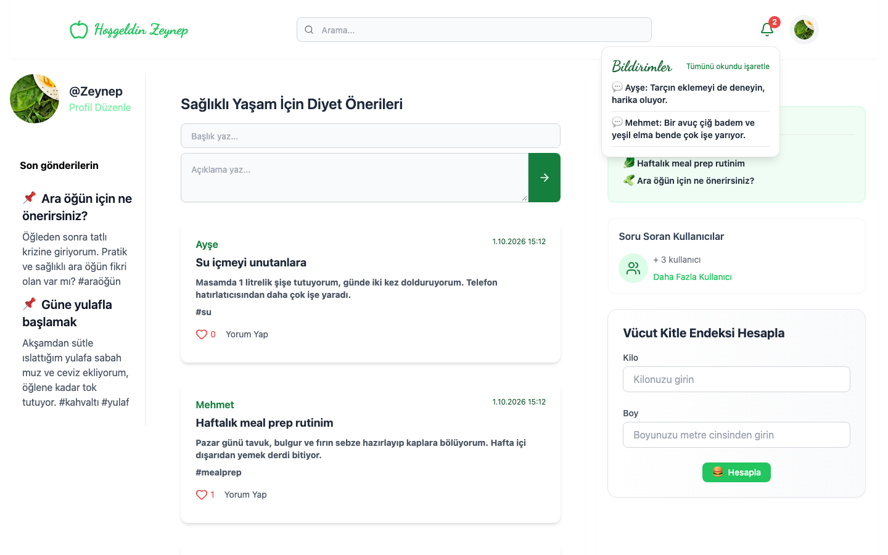
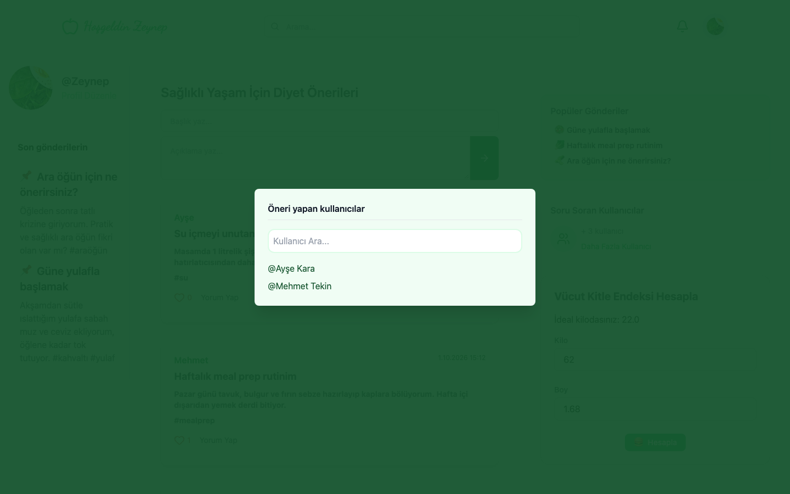
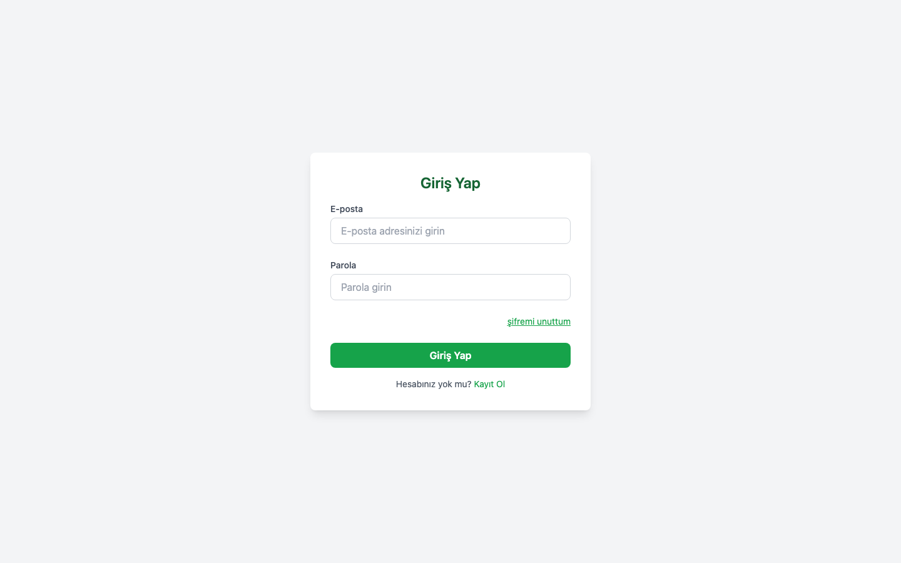
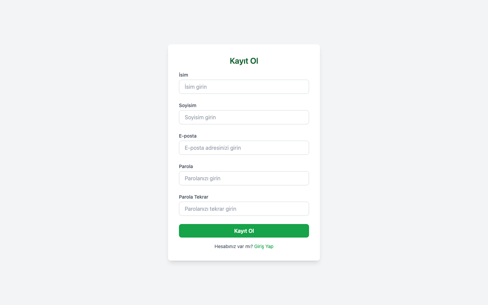
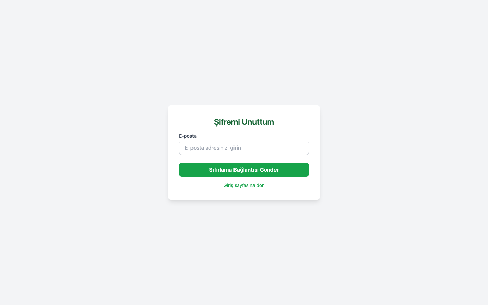

# Stack Diet

Stack Diet, kullanıcıların sağlıklı yaşam odaklı gönderiler paylaşabildiği, gönderileri beğenip yorumlayabildiği ve birbirlerinin profillerini gezebildiği bir topluluk uygulamasıdır. Kayıt/giriş, e-posta ile şifre sıfırlama, gönderi arama, yorum bildirimleri, profil fotoğrafı ve vücut kitle endeksi hesaplayıcı içerir.

## Teknolojiler

- **Client:** React 19, Vite, React Router, Zustand, Tailwind CSS, Headless UI, Axios, EmailJS
- **Server:** Node.js, Express, MongoDB (Mongoose), JWT, Zod, Nodemailer, Pino
- **Test ve araçlar:** Jest, Supertest, Vitest, Testing Library, ESLint, Prettier, GitHub Actions

## Kurulum

Node.js 22 ve çalışan bir MongoDB gerekir.

```bash
git clone https://github.com/zeynepbass/stack-diet.git
cd stack-diet
npm run install:all
cp server/.env.example server/.env
cp client/.env.example client/.env
npm run dev
```

Client `http://localhost:5173`, API `http://localhost:6079` adresinde açılır.

| Komut                             | Açıklama                                  |
| --------------------------------- | ----------------------------------------- |
| `npm run dev`                     | Client ve server'ı birlikte çalıştırır    |
| `npm test`                        | Server ve client testlerini çalıştırır    |
| `npm run lint`                    | ESLint kontrolü                           |
| `npm run format`                  | Prettier ile formatlar                    |
| `npm run build`                   | Client'ı production için derler           |
| `npm run migrate --prefix server` | Eski şemadaki kayıtları yeni şemaya taşır |

## Ortam değişkenleri

`server/.env`

| Değişken                                           | Açıklama                                                                                                                          |
| -------------------------------------------------- | --------------------------------------------------------------------------------------------------------------------------------- |
| `NODE_ENV`                                         | `development`, `test` veya `production`                                                                                           |
| `PORT`                                             | API portu (varsayılan `6079`)                                                                                                     |
| `MONGO_URI`                                        | MongoDB bağlantı adresi                                                                                                           |
| `JWT_SECRET`                                       | En az 32 karakterlik imzalama anahtarı                                                                                            |
| `JWT_EXPIRES_IN`                                   | Token süresi (varsayılan `7d`)                                                                                                    |
| `CLIENT_URL`                                       | CORS için izinli origin ve şifre sıfırlama bağlantısının adresi                                                                   |
| `SMTP_HOST`, `SMTP_PORT`, `SMTP_USER`, `SMTP_PASS` | Şifre sıfırlama e-postası için SMTP bilgileri. Production'da zorunlu; geliştirmede boş bırakılırsa bağlantı server loguna yazılır |
| `MAIL_FROM`                                        | Gönderen adresi                                                                                                                   |

`client/.env`

| Değişken                                                                         | Açıklama                                |
| -------------------------------------------------------------------------------- | --------------------------------------- |
| `VITE_API_URL`                                                                   | API adresi                              |
| `VITE_EMAILJS_SERVICE_ID`, `VITE_EMAILJS_TEMPLATE_ID`, `VITE_EMAILJS_PUBLIC_KEY` | İletişim formu için EmailJS anahtarları |

## Ekran görüntüleri

### Karşılama sayfası



### Ana sayfa



### Profil



### Bildirimler



### Kullanıcı arama



### Giriş



### Kayıt



### Şifremi unuttum


